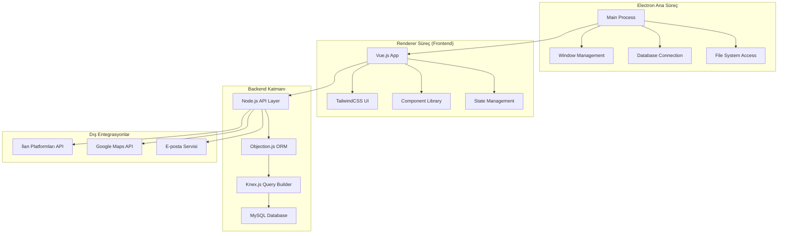

# Emlak Portföy Yönetim Sistemi - Tasarım Belgesi

## Genel Bakış

Bu belge, Electron.js tabanlı emlak portföy yönetim sisteminin teknik tasarımını detaylandırır. Sistem, modern masaüstü uygulama teknolojileri kullanarak emlak profesyonellerine kapsamlı bir yönetim platformu sunar.

## Mimari

### Genel Sistem Mimarisi



### Katmanlı Mimari

1. **Presentation Layer (Vue.js + TailwindCSS)**
   - Kullanıcı arayüzü bileşenleri
   - Form validasyonları
   - State yönetimi

2. **Business Logic Layer (Node.js)**
   - İş kuralları
   - Veri işleme
   - API entegrasyonları

3. **Data Access Layer (Objection.js + Knex.js)**
   - ORM modelleri
   - Veritabanı sorguları
   - Migration yönetimi

4. **Database Layer (MySQL)**
   - Veri saklama
   - İlişkisel veri modeli
   - İndeksleme ve optimizasyon

## Bileşenler ve Arayüzler

### Ana Bileşenler

#### 1. Electron Ana Süreç Bileşenleri

```javascript
// main.js - Ana süreç yapılandırması
const { app, BrowserWindow, ipcMain } = require('electron');
const path = require('path');
const isDev = require('electron-is-dev');

class MainProcess {
  constructor() {
    this.mainWindow = null;
    this.databaseManager = null;
  }
  
  createWindow() {
    // Ana pencere oluşturma
  }
  
  setupDatabase() {
    // Veritabanı bağlantısı kurma
  }
  
  setupIPC() {
    // IPC event handlers
  }
}
```

#### 2. Vue.js Frontend Bileşenleri

```javascript
// App.vue - Ana uygulama bileşeni
<template>
  <div id="app" class="h-screen flex">
    <Sidebar v-if="showSidebar" />
    <MainContent class="flex-1" />
    <NotificationContainer />
  </div>
</template>

// Bileşen hiyerarşisi:
// - Layout/
//   - Sidebar.vue
//   - Header.vue
//   - MainContent.vue
// - Forms/
//   - BaseForm.vue
//   - PropertyForm/
//     - ResidentialForm.vue
//     - CommercialForm.vue
// - Tables/
//   - DataTable.vue
//   - PropertyTable.vue
// - Modals/
//   - BaseModal.vue
//   - ConfirmModal.vue
```

#### 3. Backend API Katmanı

```javascript
// api/routes/index.js
const express = require('express');
const router = express.Router();

// Route modülleri
router.use('/auth', require('./auth'));
router.use('/properties', require('./properties'));
router.use('/customers', require('./customers'));
router.use('/appointments', require('./appointments'));
router.use('/listings', require('./listings'));

module.exports = router;
```

### Arayüz Tasarımı

#### Form Bileşenleri Sistemi

```javascript
// components/forms/BaseInput.vue
<template>
  <div class="form-group" :class="sizeClass">
    <label v-if="label && labelPosition === 'top'" 
           :class="labelClass">
      {{ label }}
      <span v-if="required" class="text-red-500">*</span>
    </label>
    
    <div class="input-wrapper" :class="wrapperClass">
      <label v-if="label && labelPosition === 'left'" 
             :class="labelClass">
        {{ label }}
        <span v-if="required" class="text-red-500">*</span>
      </label>
      
      <input 
        :type="type"
        :value="modelValue"
        @input="handleInput"
        @blur="handleBlur"
        :class="inputClass"
        :placeholder="placeholder"
        :disabled="disabled"
      />
    </div>
    
    <div v-if="error" class="error-message text-xs italic text-red-500 mt-1">
      {{ error }}
    </div>
  </div>
</template>
```

#### Modal Sistemi

```javascript
// components/modals/BaseModal.vue
<template>
  <teleport to="body">
    <div v-if="show" class="modal-overlay fixed inset-0 z-50">
      <div class="modal-backdrop absolute inset-0 bg-black bg-opacity-50"></div>
      
      <div class="modal-container flex items-center justify-center min-h-screen p-4">
        <div :class="modalClass" class="modal-content bg-white relative">
          <!-- Amber border -->
          <div class="border-2 border-amber-500 h-full p-6">
            <!-- Header with fixed icons -->
            <div class="modal-header flex justify-end mb-4">
              <div class="flex space-x-2">
                <button @click="save" class="text-green-600 hover:text-green-800">
                  <SaveIcon />
                </button>
                <button @click="clear" class="text-yellow-600 hover:text-yellow-800">
                  <ClearIcon />
                </button>
                <button @click="close" class="text-red-600 hover:text-red-800">
                  <CloseIcon />
                </button>
              </div>
            </div>
            
            <!-- Content -->
            <div class="modal-body">
              <slot />
            </div>
          </div>
        </div>
      </div>
    </div>
  </teleport>
</template>
```

## Veri Modelleri

### Temel Model Yapısı

```javascript
// models/BaseModel.js
const { Model } = require('objection');
const { v4: uuidv4 } = require('uuid');

class BaseModel extends Model {
  static get idColumn() {
    return 'id';
  }
  
  $beforeInsert() {
    this.id = uuidv4();
    this.olusturma_tarihi = new Date();
    this.guncelleme_tarihi = new Date();
    this.aktif_mi = true;
    this.siralama = this.siralama || 1;
  }
  
  $beforeUpdate() {
    this.guncelleme_tarihi = new Date();
  }
  
  // Soft delete
  static get modifiers() {
    return {
      aktif: (query) => {
        query.whereNull('silinme_tarihi');
      }
    };
  }
  
  softDelete() {
    return this.$query().patch({
      silinme_tarihi: new Date()
    });
  }
}
```

### Ana Veri Modelleri

#### Kişi Modeli

```javascript
// models/Kisi.js
const { CinsiyetEnum, MedeniDurumEnum } = require('../enums');

class Kisi extends BaseModel {
  static get tableName() {
    return 'kisiler';
  }
  
  static get jsonSchema() {
    return {
      type: 'object',
      required: ['ad', 'soyad'],
      properties: {
        id: { type: 'string' },
        ad: { type: 'string', minLength: 1, maxLength: 100 },
        soyad: { type: 'string', minLength: 1, maxLength: 100 },
        tc_kimlik_no: { type: 'string', pattern: '^[0-9]{11}$' },
        dogum_tarihi: { type: 'string', format: 'date' },
        cinsiyet: { enum: CinsiyetEnum.values() },
        dogum_yeri: { type: 'string', maxLength: 100 },
        email: { type: 'string', format: 'email' },
        medeni_durum: { enum: MedeniDurumEnum.values() }
      }
    };
  }
  
  static get relationMappings() {
    return {
      adresler: {
        relation: Model.MorphManyRelation,
        modelClass: require('./Adres'),
        join: {
          from: 'kisiler.id',
          to: 'adresler.adreslenebilir_id'
        },
        filter: { adreslenebilir_type: 'Kisi' }
      },
      
      telefonlar: {
        relation: Model.MorphManyRelation,
        modelClass: require('./Telefon'),
        join: {
          from: 'kisiler.id',
          to: 'telefonlar.telefonlanabilir_id'
        },
        filter: { telefonlanabilir_type: 'Kisi' }
      },
      
      resim: {
        relation: Model.MorphOneRelation,
        modelClass: require('./Resim'),
        join: {
          from: 'kisiler.id',
          to: 'resimler.resimlenebilir_id'
        },
        filter: { resimlenebilir_type: 'Kisi', profil_resmi: true }
      },
      
      notlar: {
        relation: Model.MorphManyRelation,
        modelClass: require('./Not'),
        join: {
          from: 'kisiler.id',
          to: 'notlar.notlanabilir_id'
        },
        filter: { notlanabilir_type: 'Kisi' }
      },
      
      firmalar: {
        relation: Model.MorphManyRelation,
        modelClass: require('./Firma'),
        join: {
          from: 'kisiler.id',
          to: 'firmalar.firmalanabilir_id'
        },
        filter: { firmalanabilir_type: 'Kisi' }
      }
    };
  }
}
```

#### Mülk Modeli

```javascript
// models/Mulk.js
class Mulk extends BaseModel {
  static get tableName() {
    return 'mulkler';
  }
  
  static get jsonSchema() {
    return {
      type: 'object',
      required: ['baslik', 'kategori_id', 'mulk_tipi_id'],
      properties: {
        id: { type: 'string' },
        portfoy_no: { type: 'string' },
        baslik: { type: 'string', minLength: 1, maxLength: 255 },
        aciklama: { type: 'string' },
        fiyat: { type: 'number', minimum: 0 },
        metrekare: { type: 'number', minimum: 0 },
        oda_sayisi: { type: 'integer', minimum: 0 },
        banyo_sayisi: { type: 'integer', minimum: 0 },
        kat: { type: 'integer' },
        koordinat_x: { type: 'number' },
        koordinat_y: { type: 'number' },
        dinamik_ozellikler: { type: 'object' }
      }
    };
  }
  
  static get relationMappings() {
    return {
      kategori: {
        relation: Model.BelongsToOneRelation,
        modelClass: require('./MulkKategorisi'),
        join: {
          from: 'mulkler.kategori_id',
          to: 'mulk_kategorileri.id'
        }
      },
      
      sahip: {
        relation: Model.BelongsToOneRelation,
        modelClass: require('./Kisi'),
        join: {
          from: 'mulkler.sahip_id',
          to: 'kisiler.id'
        }
      },
      
      resimler: {
        relation: Model.MorphManyRelation,
        modelClass: require('./Resim'),
        join: {
          from: 'mulkler.id',
          to: 'resimler.resimlenebilir_id'
        },
        filter: { resimlenebilir_type: 'Mulk' }
      }
    };
  }
  
  $beforeInsert() {
    super.$beforeInsert();
    if (!this.portfoy_no) {
      this.portfoy_no = this.generatePortfoyNo();
    }
  }
  
  generatePortfoyNo() {
    const year = new Date().getFullYear();
    const random = Math.floor(Math.random() * 10000).toString().padStart(4, '0');
    return `PF${year}${random}`;
  }
}
```

### Polimorfik İlişki Modelleri

```javascript
// models/Adres.js
class Adres extends BaseModel {
  static get tableName() {
    return 'adresler';
  }
  
  static get relationMappings() {
    return {
      sehir: {
        relation: Model.BelongsToOneRelation,
        modelClass: require('./Sehir'),
        join: {
          from: 'adresler.sehir_id',
          to: 'sehirler.id'
        }
      },
      
      ilce: {
        relation: Model.BelongsToOneRelation,
        modelClass: require('./Ilce'),
        join: {
          from: 'adresler.ilce_id',
          to: 'ilceler.id'
        }
      }
    };
  }
}

// models/Resim.js
class Resim extends BaseModel {
  static get tableName() {
    return 'resimler';
  }
  
  static get jsonSchema() {
    return {
      type: 'object',
      required: ['ad', 'dosya_adi', 'dosya_yolu'],
      properties: {
        ad: { type: 'string', minLength: 1 },
        dosya_adi: { type: 'string' },
        dosya_yolu: { type: 'string' },
        mime_type: { type: 'string' },
        dosya_boyutu: { type: 'integer', minimum: 0 },
        genislik: { type: 'integer', minimum: 0 },
        yukseklik: { type: 'integer', minimum: 0 }
      }
    };
  }
}
```

## Hata Yönetimi

### Hata Yakalama Stratejisi

```javascript
// utils/ErrorHandler.js
class ErrorHandler {
  static handle(error, context = {}) {
    const errorInfo = {
      message: error.message,
      stack: error.stack,
      context,
      timestamp: new Date(),
      userId: context.userId || null
    };
    
    // Log to file
    this.logToFile(errorInfo);
    
    // Log to database
    this.logToDatabase(errorInfo);
    
    // Notify user
    this.notifyUser(error);
  }
  
  static logToFile(errorInfo) {
    const fs = require('fs');
    const path = require('path');
    
    const logPath = path.join(__dirname, '../logs/errors.log');
    const logEntry = `${errorInfo.timestamp.toISOString()} - ${JSON.stringify(errorInfo)}\n`;
    
    fs.appendFileSync(logPath, logEntry);
  }
  
  static async logToDatabase(errorInfo) {
    try {
      await require('../models/ErrorLog').query().insert({
        mesaj: errorInfo.message,
        stack_trace: errorInfo.stack,
        context: JSON.stringify(errorInfo.context),
        kullanici_id: errorInfo.userId
      });
    } catch (dbError) {
      console.error('Database logging failed:', dbError);
    }
  }
  
  static notifyUser(error) {
    // IPC ile frontend'e hata gönder
    const { ipcMain } = require('electron');
    ipcMain.emit('show-error', {
      title: 'Sistem Hatası',
      message: error.message,
      type: 'error'
    });
  }
}
```

### Validasyon Sistemi

```javascript
// utils/Validator.js
class Validator {
  static validateTcKimlik(tc) {
    if (!tc || tc.length !== 11) {
      return { valid: false, message: 'TC Kimlik numarası 11 haneli olmalıdır' };
    }
    
    if (!/^\d+$/.test(tc)) {
      return { valid: false, message: 'TC Kimlik numarası sadece rakam içermelidir' };
    }
    
    // TC kimlik algoritması
    const digits = tc.split('').map(Number);
    const sum1 = digits[0] + digits[2] + digits[4] + digits[6] + digits[8];
    const sum2 = digits[1] + digits[3] + digits[5] + digits[7];
    
    if ((sum1 * 7 - sum2) % 10 !== digits[9]) {
      return { valid: false, message: 'Geçersiz TC Kimlik numarası' };
    }
    
    return { valid: true };
  }
  
  static validatePhone(phone) {
    const phoneRegex = /^0\(\d{3}\)\d{3} \d{4}$/;
    if (!phoneRegex.test(phone)) {
      return { valid: false, message: 'Telefon numarası 0(###)### #### formatında olmalıdır' };
    }
    return { valid: true };
  }
  
  static validateEmail(email) {
    const emailRegex = /^[^\s@]+@[^\s@]+\.[^\s@]+$/;
    if (!emailRegex.test(email)) {
      return { valid: false, message: 'Geçerli bir e-posta adresi giriniz' };
    }
    return { valid: true };
  }
}
```

## Test Stratejisi

### Birim Testleri

```javascript
// tests/unit/models/Kisi.test.js
const { expect } = require('chai');
const Kisi = require('../../../models/Kisi');

describe('Kisi Model', () => {
  describe('TC Kimlik Validasyonu', () => {
    it('geçerli TC kimlik numarasını kabul etmeli', () => {
      const kisi = new Kisi();
      kisi.tc_kimlik_no = '12345678901';
      
      const validation = kisi.$validate();
      expect(validation.tc_kimlik_no).to.be.undefined;
    });
    
    it('geçersiz TC kimlik numarasını reddetmeli', () => {
      const kisi = new Kisi();
      kisi.tc_kimlik_no = '123';
      
      const validation = kisi.$validate();
      expect(validation.tc_kimlik_no).to.exist;
    });
  });
});
```

### Entegrasyon Testleri

```javascript
// tests/integration/api/properties.test.js
const request = require('supertest');
const app = require('../../../app');

describe('Properties API', () => {
  describe('POST /api/properties', () => {
    it('yeni mülk oluşturmalı', async () => {
      const propertyData = {
        baslik: 'Test Mülk',
        kategori_id: 'uuid-here',
        fiyat: 500000,
        metrekare: 120
      };
      
      const response = await request(app)
        .post('/api/properties')
        .send(propertyData)
        .expect(201);
        
      expect(response.body.data.baslik).to.equal('Test Mülk');
      expect(response.body.data.portfoy_no).to.exist;
    });
  });
});
```

### E2E Testleri

```javascript
// tests/e2e/property-management.test.js
const { Application } = require('spectron');
const path = require('path');

describe('Mülk Yönetimi E2E', () => {
  let app;
  
  beforeEach(async () => {
    app = new Application({
      path: path.join(__dirname, '../../dist/electron/main.js')
    });
    await app.start();
  });
  
  afterEach(async () => {
    if (app && app.isRunning()) {
      await app.stop();
    }
  });
  
  it('yeni mülk ekleme formu çalışmalı', async () => {
    await app.client.click('#add-property-btn');
    await app.client.waitForVisible('#property-form');
    
    await app.client.setValue('#property-title', 'Test Mülk');
    await app.client.selectByValue('#property-category', 'konut');
    
    await app.client.click('#save-property-btn');
    
    const notification = await app.client.getText('.notification-success');
    expect(notification).to.contain('Mülk başarıyla kaydedildi');
  });
});
```

## Güvenlik Mimarisi

### Kimlik Doğrulama ve Yetkilendirme

```javascript
// services/AuthService.js
const bcrypt = require('bcrypt');
const jwt = require('jsonwebtoken');

class AuthService {
  static async login(email, password) {
    const user = await User.query()
      .findOne({ email })
      .withGraphFetched('roller');
    
    if (!user || !await bcrypt.compare(password, user.password)) {
      throw new Error('Geçersiz kullanıcı adı veya şifre');
    }
    
    const token = jwt.sign(
      { 
        userId: user.id, 
        roles: user.roller.map(r => r.ad) 
      },
      process.env.JWT_SECRET,
      { expiresIn: '8h' }
    );
    
    // Son giriş zamanını güncelle
    await user.$query().patch({
      son_giris_tarihi: new Date(),
      son_giris_ip: this.getClientIP()
    });
    
    return { user, token };
  }
  
  static async checkPermission(userId, resource, action) {
    const user = await User.query()
      .findById(userId)
      .withGraphFetched('roller.yetkiler');
    
    const hasPermission = user.roller.some(rol => 
      rol.yetkiler.some(yetki => 
        yetki.kaynak === resource && yetki.eylem === action
      )
    );
    
    if (!hasPermission) {
      await this.logSecurityEvent(userId, 'UNAUTHORIZED_ACCESS', {
        resource,
        action
      });
      throw new Error('Bu işlem için yetkiniz bulunmamaktadır');
    }
    
    return true;
  }
}
```

### Veri Şifreleme

```javascript
// utils/Encryption.js
const crypto = require('crypto');

class Encryption {
  static encrypt(text) {
    const algorithm = 'aes-256-gcm';
    const key = Buffer.from(process.env.ENCRYPTION_KEY, 'hex');
    const iv = crypto.randomBytes(16);
    
    const cipher = crypto.createCipher(algorithm, key);
    cipher.setAAD(Buffer.from('emlak-app', 'utf8'));
    
    let encrypted = cipher.update(text, 'utf8', 'hex');
    encrypted += cipher.final('hex');
    
    const authTag = cipher.getAuthTag();
    
    return {
      encrypted,
      iv: iv.toString('hex'),
      authTag: authTag.toString('hex')
    };
  }
  
  static decrypt(encryptedData) {
    const algorithm = 'aes-256-gcm';
    const key = Buffer.from(process.env.ENCRYPTION_KEY, 'hex');
    
    const decipher = crypto.createDecipher(algorithm, key);
    decipher.setAAD(Buffer.from('emlak-app', 'utf8'));
    decipher.setAuthTag(Buffer.from(encryptedData.authTag, 'hex'));
    
    let decrypted = decipher.update(encryptedData.encrypted, 'hex', 'utf8');
    decrypted += decipher.final('utf8');
    
    return decrypted;
  }
}
```

## Performans Optimizasyonu

### Veritabanı Optimizasyonu

```javascript
// config/database.js
const knexConfig = {
  client: 'mysql2',
  connection: {
    host: process.env.DB_HOST || 'localhost',
    port: process.env.DB_PORT || 3306,
    user: process.env.DB_USER,
    password: process.env.DB_PASSWORD,
    database: process.env.DB_NAME,
    charset: 'utf8mb4'
  },
  pool: {
    min: 2,
    max: 10,
    acquireTimeoutMillis: 30000,
    createTimeoutMillis: 30000,
    destroyTimeoutMillis: 5000,
    idleTimeoutMillis: 30000,
    reapIntervalMillis: 1000,
    createRetryIntervalMillis: 100
  },
  migrations: {
    directory: './migrations',
    tableName: 'knex_migrations'
  },
  seeds: {
    directory: './seeds'
  }
};
```

### Frontend Optimizasyonu

```javascript
// utils/LazyLoader.js
class LazyLoader {
  static async loadComponent(componentName) {
    const components = {
      PropertyForm: () => import('../components/forms/PropertyForm.vue'),
      CustomerTable: () => import('../components/tables/CustomerTable.vue'),
      ReportDashboard: () => import('../components/reports/Dashboard.vue')
    };
    
    if (components[componentName]) {
      return await components[componentName]();
    }
    
    throw new Error(`Component ${componentName} not found`);
  }
  
  static preloadCriticalComponents() {
    const critical = [
      'PropertyForm',
      'CustomerTable',
      'MainDashboard'
    ];
    
    critical.forEach(component => {
      this.loadComponent(component).catch(console.error);
    });
  }
}
```

### Önbellek Stratejisi

```javascript
// services/CacheService.js
class CacheService {
  constructor() {
    this.cache = new Map();
    this.ttl = new Map();
  }
  
  set(key, value, ttlSeconds = 300) {
    this.cache.set(key, value);
    this.ttl.set(key, Date.now() + (ttlSeconds * 1000));
  }
  
  get(key) {
    if (this.isExpired(key)) {
      this.delete(key);
      return null;
    }
    
    return this.cache.get(key);
  }
  
  isExpired(key) {
    const expiry = this.ttl.get(key);
    return expiry && Date.now() > expiry;
  }
  
  delete(key) {
    this.cache.delete(key);
    this.ttl.delete(key);
  }
  
  // Lokasyon verilerini önbelleğe al
  async getCities() {
    const cacheKey = 'cities';
    let cities = this.get(cacheKey);
    
    if (!cities) {
      cities = await Sehir.query().orderBy('ad');
      this.set(cacheKey, cities, 3600); // 1 saat
    }
    
    return cities;
  }
}
```

Bu tasarım belgesi, sistemin tüm teknik yönlerini kapsamlı şekilde ele alır ve gereksinimler belgesindeki tüm kriterleri karşılayacak şekilde yapılandırılmıştır.###
 Morph Modelleri

#### Telefon Modeli

```javascript
// models/Telefon.js
const { TelefonTipiEnum } = require('../enums');

class Telefon extends BaseModel {
  static get tableName() {
    return 'telefonlar';
  }
  
  static get jsonSchema() {
    return {
      type: 'object',
      required: ['numara', 'tip'],
      properties: {
        id: { type: 'string' },
        numara: { type: 'string', maxLength: 20 },
        tip: { enum: TelefonTipiEnum.values() }, // ev, is, cep, faks
        varsayilan_mi: { type: 'boolean', default: false },
        telefonlanabilir_id: { type: 'string' },
        telefonlanabilir_type: { type: 'string' }
      }
    };
  }
}
```

#### Kategori Modeli

```javascript
// models/Kategori.js
class Kategori extends BaseModel {
  static get tableName() {
    return 'kategoriler';
  }
  
  static get jsonSchema() {
    return {
      type: 'object',
      required: ['ad'],
      properties: {
        id: { type: 'string' },
        ad: { type: 'string', maxLength: 100 },
        aciklama: { type: 'string' },
        ust_kategori_id: { type: 'string' },
        kategorilenebilir_id: { type: 'string' },
        kategorilenebilir_type: { type: 'string' },
        seviye: { type: 'integer', default: 1 }
      }
    };
  }
  
  static get relationMappings() {
    return {
      ustKategori: {
        relation: Model.BelongsToOneRelation,
        modelClass: Kategori,
        join: {
          from: 'kategoriler.ust_kategori_id',
          to: 'kategoriler.id'
        }
      },
      
      altKategoriler: {
        relation: Model.HasManyRelation,
        modelClass: Kategori,
        join: {
          from: 'kategoriler.id',
          to: 'kategoriler.ust_kategori_id'
        }
      }
    };
  }
}
```

#### Rol Modeli

```javascript
// models/Rol.js
class Rol extends BaseModel {
  static get tableName() {
    return 'roller';
  }
  
  static get jsonSchema() {
    return {
      type: 'object',
      required: ['ad'],
      properties: {
        id: { type: 'string' },
        ad: { type: 'string', maxLength: 100 },
        aciklama: { type: 'string' },
        yetkiler: { type: 'object' }, // JSON field
        rollenebilir_id: { type: 'string' },
        rollenebilir_type: { type: 'string' }
      }
    };
  }
}
```

#### Firma Modeli

```javascript
// models/Firma.js
const { FirmaTipiEnum } = require('../enums');

class Firma extends BaseModel {
  static get tableName() {
    return 'firmalar';
  }
  
  static get jsonSchema() {
    return {
      type: 'object',
      required: ['ad'],
      properties: {
        id: { type: 'string' },
        ad: { type: 'string', maxLength: 200 },
        vergi_no: { type: 'string', maxLength: 20 },
        vergi_dairesi: { type: 'string', maxLength: 100 },
        tip: { enum: FirmaTipiEnum.values() }, // limited, anonim, sahis
        sektor: { type: 'string', maxLength: 100 },
        firmalanabilir_id: { type: 'string' },
        firmalanabilir_type: { type: 'string' }
      }
    };
  }
  
  static get relationMappings() {
    return {
      adresler: {
        relation: Model.MorphManyRelation,
        modelClass: require('./Adres'),
        join: {
          from: 'firmalar.id',
          to: 'adresler.adreslenebilir_id'
        },
        filter: { adreslenebilir_type: 'Firma' }
      },
      
      telefonlar: {
        relation: Model.MorphManyRelation,
        modelClass: require('./Telefon'),
        join: {
          from: 'firmalar.id',
          to: 'telefonlar.telefonlanabilir_id'
        },
        filter: { telefonlanabilir_type: 'Firma' }
      }
    };
  }
}
```

#### Not Modeli

```javascript
// models/Not.js
const { NotTipiEnum } = require('../enums');

class Not extends BaseModel {
  static get tableName() {
    return 'notlar';
  }
  
  static get jsonSchema() {
    return {
      type: 'object',
      required: ['baslik', 'icerik'],
      properties: {
        id: { type: 'string' },
        baslik: { type: 'string', maxLength: 200 },
        icerik: { type: 'string' },
        tip: { enum: NotTipiEnum.values() }, // genel, onemli, hatirlatma
        renk: { type: 'string', maxLength: 7 }, // hex color
        notlanabilir_id: { type: 'string' },
        notlanabilir_type: { type: 'string' }
      }
    };
  }
}
```

### Enum Yapıları

```javascript
// enums/index.js
class CinsiyetEnum {
  static ERKEK = 'erkek';
  static KADIN = 'kadin';
  
  static values() {
    return [this.ERKEK, this.KADIN];
  }
  
  static labels() {
    return {
      [this.ERKEK]: 'Erkek',
      [this.KADIN]: 'Kadın'
    };
  }
}

class MedeniDurumEnum {
  static BEKAR = 'bekar';
  static EVLI = 'evli';
  static DUL = 'dul';
  static BOSANMIS = 'bosanmis';
  
  static values() {
    return [this.BEKAR, this.EVLI, this.DUL, this.BOSANMIS];
  }
  
  static labels() {
    return {
      [this.BEKAR]: 'Bekar',
      [this.EVLI]: 'Evli',
      [this.DUL]: 'Dul',
      [this.BOSANMIS]: 'Boşanmış'
    };
  }
}

class TelefonTipiEnum {
  static EV = 'ev';
  static IS = 'is';
  static CEP = 'cep';
  static FAKS = 'faks';
  
  static values() {
    return [this.EV, this.IS, this.CEP, this.FAKS];
  }
  
  static labels() {
    return {
      [this.EV]: 'Ev',
      [this.IS]: 'İş',
      [this.CEP]: 'Cep',
      [this.FAKS]: 'Faks'
    };
  }
}

class AdresTipiEnum {
  static EV = 'ev';
  static IS = 'is';
  static FATURA = 'fatura';
  static DIGER = 'diger';
  
  static values() {
    return [this.EV, this.IS, this.FATURA, this.DIGER];
  }
  
  static labels() {
    return {
      [this.EV]: 'Ev',
      [this.IS]: 'İş',
      [this.FATURA]: 'Fatura',
      [this.DIGER]: 'Diğer'
    };
  }
}

module.exports = {
  CinsiyetEnum,
  MedeniDurumEnum,
  TelefonTipiEnum,
  AdresTipiEnum
};
```

### Dinamik Veri Ekleme Sistemi

```javascript
// components/forms/DynamicSelect.vue
<template>
  <div class="dynamic-select-wrapper">
    <div class="flex items-center space-x-2">
      <BaseSelect
        v-model="selectedValue"
        :options="options"
        :placeholder="placeholder"
        :loading="loading"
        @change="handleChange"
      />
      
      <button
        @click="openAddModal"
        class="flex items-center justify-center w-8 h-8 bg-amber-500 text-white rounded hover:bg-amber-600 transition-colors"
        :title="`Yeni ${entityName} Ekle`"
      >
        <PlusIcon class="w-4 h-4" />
      </button>
    </div>
    
    <!-- Add Modal -->
    <BaseModal
      v-model:show="showAddModal"
      :title="`Yeni ${entityName} Ekle`"
      size="md"
      @save="handleSave"
      @close="closeAddModal"
    >
      <component
        :is="addFormComponent"
        ref="addForm"
        @saved="handleItemAdded"
      />
    </BaseModal>
  </div>
</template>

<script>
export default {
  name: 'DynamicSelect',
  props: {
    modelValue: String,
    entityName: String,
    apiEndpoint: String,
    addFormComponent: String,
    placeholder: String
  },
  
  data() {
    return {
      options: [],
      loading: false,
      showAddModal: false,
      selectedValue: this.modelValue
    };
  },
  
  methods: {
    async loadOptions() {
      this.loading = true;
      try {
        const response = await this.$api.get(this.apiEndpoint);
        this.options = response.data.map(item => ({
          value: item.id,
          label: item.ad || item.name
        }));
      } catch (error) {
        this.$toast.error(`${this.entityName} listesi yüklenemedi`);
      } finally {
        this.loading = false;
      }
    },
    
    openAddModal() {
      this.showAddModal = true;
    },
    
    closeAddModal() {
      this.showAddModal = false;
    },
    
    async handleSave() {
      if (this.$refs.addForm) {
        await this.$refs.addForm.save();
      }
    },
    
    handleItemAdded(newItem) {
      this.options.push({
        value: newItem.id,
        label: newItem.ad || newItem.name
      });
      this.selectedValue = newItem.id;
      this.$emit('update:modelValue', newItem.id);
      this.closeAddModal();
      this.$toast.success(`${this.entityName} başarıyla eklendi`);
    },
    
    handleChange(value) {
      this.selectedValue = value;
      this.$emit('update:modelValue', value);
    }
  },
  
  mounted() {
    this.loadOptions();
  }
};
</script>
```